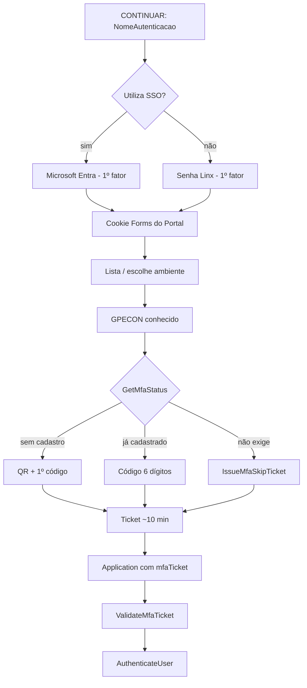

# Estória da construção do MFA — Linx UX

Documento de produto e engenharia: **por que** o MFA existe, **o que** foi combinado e **como** foi construído.  
Não substitui o guia do usuário nem o cookbook de APIs.  
Versão em Word: [Linx-UX-Estoria-Construcao-MFA.docx](Linx-UX-Estoria-Construcao-MFA.docx).

| Público | Documento |
|---------|-----------|
| Usuário / operação no Portal | [login-mfa-sso-usuario.md](login-mfa-sso-usuario.md) · [Linx-UX-MFA-SSO-Portal.docx](Linx-UX-MFA-SSO-Portal.docx) |
| Integração / desktop / APIs | [login-mfa-sso-api.md](login-mfa-sso-api.md) · [login-mfa-sso-desktop-dotnet.md](login-mfa-sso-desktop-dotnet.md) |
| Schema SQL | [APPLY_SSO_MFA.md](../Main/BM/Linx.Framework.Autorizacao.BM/Linx.Framework.Autorizacao.BM/Scripts/APPLY_SSO_MFA.md) |
| Plano técnico vigente | [mfa-totp-framework-ux.mdc](../.cursor/rules/mfa-totp-framework-ux.mdc) |
| Pacote de implantação IIS | `packages/INSTALL_MFA_SSO/` |

Branch de referência desta entrega: `feature/implementacao-completa-ss-mfa-5-10-2026`.  
Primeira entrega: **Portal + Application** (`tableOrigin = UX`). PDV / `LJV_VENDEDOR` ficou só schema/API.

---

## 1. Épico

**Como** empresa Linx UX,  
**quero** um segundo fator TOTP próprio (Google Authenticator / Microsoft Authenticator) depois do login e da escolha de empresa,  
**para** o Application só abrir com um ticket MFA válido, mesmo quando o primeiro fator for senha ou Microsoft (SSO).

Critérios do épico:

- MFA **não** fica na tela de senha/SSO. Roda **depois** que o GPECON (`IdLinxGpecon`) é conhecido.
- SSO Azure prova **quem é** a pessoa. **Não** substitui o código de 6 dígitos do Linx.
- Cookie Forms do Portal **não** autoriza o Application sozinho.
- Segredo TOTP (`ACCESS_SECRET`) nunca é logado em claro.
- Sem tela administrativa nova: flags e revogação entram nos cadastros de usuário já existentes.
- Sem aplicativo autenticador próprio: o usuário usa Google ou Microsoft Authenticator.

---

## 2. Estórias de produto

### MFA-01 — Status e política por empresa

**Como** o Portal (depois de escolher o ambiente),  
**quero** saber se aquele usuário+GPECON exige TOTP,  
**para** decidir entre cadastro (QR), desafio (6 dígitos) ou skip documentado.

Aceite:

- `GetMfaStatus` recebe `tableOrigin`, `idGpecon` e `uidUsuario` / `idUserMfa`.
- Sem linha em `TCS_GPECON_MFA` = MFA **ligado** (opt-out).
- Empresa com `INDICA_MFA_HABILITADO = 0` desliga MFA para todos os usuários daquele GPECON.
- Política é **por GPECON**, não por `TCS_AMBIENTE`. Dois ambientes da mesma empresa compartilham a mesma política e o mesmo secret por usuário+origem.

### MFA-02 — Primeiro acesso: QR e confirmação

**Como** usuário da empresa com MFA ligado e sem cadastro,  
**quero** escanear um QR e confirmar o primeiro código de 6 dígitos,  
**para** gravar o autenticador naquela empresa.

Aceite:

- `BeginMfaEnrollment` gera secret (Base32), grava criptografado (`Linx.Security.Cryptography`, `UseSeed = false`) com `ATIVO = 0`.
- URI `otpauth://totp/` com issuer = nome da empresa e label = `empresa:NomeAutenticacao`.
- `ConfirmMfaEnrollment` com código válido define `ATIVO = 1`.
- Sem o primeiro código, o cadastro não fecha e o Application não abre.

### MFA-03 — Acessos seguintes: código de 6 dígitos

**Como** usuário já cadastrado,  
**quero** informar o código do autenticador a cada login,  
**para** receber um ticket curto e entrar no Application.

Aceite:

- TOTP RFC 6238, 6 dígitos, passo 30 s, algoritmo SHA1, janela ±2 passos (alargada em 10/09/2026).
- 5 falhas seguidas → bloqueio de 15 minutos (`QTD_TENTATIVAS_TOTP` / `DATA_BLOQUEIO_ATE`), separado do lockout de senha.
- Sucesso emite ticket MFA (~10 minutos). Portal anexa `mfaTicket` na URL do Application.
- `LIAController.Authentication` rejeita querystring sem ticket válido (salvo skip documentado).

### MFA-04 — Quando o MFA não pede código

**Como** canal de integração ou usuário excepcional,  
**quero** regras explícitas de skip,  
**para** não travar usuário de serviço, autenticação Windows ou empresa com MFA desligado.

Aceite (origem `UX`):

| Condição | Portal | API / Desktop / Service |
|----------|--------|-------------------------|
| `INDICA_USUARIO_SERVICO` | recusa o login (`ERRAUT022`) | entra e **não** pede TOTP |
| `AUTENTICACAO_WINDOWS` | skip TOTP | skip TOTP |
| Empresa MFA off | skip TOTP | skip TOTP |
| `INDICA_UTILIZA_MFA = 0` | skip TOTP | skip TOTP |
| `INDICA_UTILIZA_MFA` NULL ou 1 | exige TOTP | exige TOTP |
| Login Microsoft (SSO) | **não** skip | **não** skip |

Skip documentado ainda emite `IssueMfaSkipTicket` para o Application ter um ticket.

Suporte / impersonação: o desafio é do **usuário impersonado**, no GPECON selecionado.

### MFA-05 — Administração no cadastro de usuário

**Como** administrador,  
**quero** ligar/desligar “Utiliza MFA” e revogar o secret na ficha do usuário UX,  
**para** o próximo acesso pedir um QR novo, sem tela extra.

Aceite:

- Controles em **Cadastro e manutenção de usuários** (`CadastroUsuarioLocal`), **Usuário (Server)** (`CadastroUsuarioAutenticacao`) e **CadastroUsuario**.
- **Revoga MFA** limpa `ACCESS_SECRET`, `ATIVO = 0`, tentativas e dispositivos confiáveis daquele `(TABLE_ORIGIN, ID_GPCON, ID_USER_MFA)`.
- Revogar **não** desliga a política da empresa. Não altera senha nem vínculo SSO.
- Botão habilitado só com MFA cadastrado (`CanRevoke`) e flag Utiliza MFA ligada.
- Chamada da UI: `RevokeMfaSecret` com `tableOrigin = UX`.

**Não há** Revoga MFA / Revoga SSO na tela de vendedor (`LojaVendedor` / `LJV_VENDEDOR`).

### MFA-06 — Application só entra com ticket

**Como** Application,  
**quero** validar `mfaTicket` antes de `AuthenticateUser`,  
**para** um bookmark ou cookie de Portal não furar o segundo fator.

Aceite:

- Envelope interno do ticket: `MFA||origin||idGpecon||idUserMfa||expUnix||reason` (não logar plaintext).
- TTL 10 minutos.
- `ValidateMfaTicket` no Service; Application chama via `LIA/Authentication`.

### MFA-07 — Origens futuras (schema pronto, UI não ligada)

**Como** produto,  
**quero** a chave MFA `(TABLE_ORIGIN, ID_GPCON, ID_USER_MFA)`,  
**para** PDV e Cliente Connect não misturarem secret com o usuário UX.

Aceite nesta entrega:

| `tableOrigin` | Quem é `idUserMfa` | UI nesta entrega |
|---------------|--------------------|------------------|
| `UX` | `TCS_USUARIO_AUTENTICACAO.ID_USUARIO` | Portal + cadastros de usuário |
| `PDV` (alias `LJV_VENDEDOR`) | `LJV_VENDEDOR.ID_VENDEDOR` | **não ligar** |
| `CLIENTE_CONNECT` | id do caller | **não ligar** |

---

## 3. Decisões de construção

1. **Service é a fonte da verdade.** Portal e Application só orquestram HTTP. Desktop .NET fala direto com `:1710`.
2. **SQL manual**, no mesmo padrão de `TCS_LOG_ACESSO_AUTH`. Sem gerar entidade BMD / Cadastro para MFA.
3. **Opt-out por empresa:** ausência de linha em `TCS_GPECON_MFA` = MFA on.
4. **Um secret por usuário + empresa + origem.** Usuário multi-GPECON cadastra QR em cada empresa.
5. **Dispositivo confiável** ficou no banco e nas APIs (`LinkMfaDevice` / `CheckMfaDevice`); checkbox da UI **escondido**; default 0 dias.
6. **UTF-8 com BOM** nos `.cs` / `.cshtml` novos: no IIS da AWS o `csc`/Razor default é Windows-1252 (`código` virava `código`).
7. **Pacote overlay** `INSTALL_MFA_SSO` (30/09/2026) para instalar em IIS existente sem republicar o produto inteiro. Não traz `Web.config` (SSO secret fica no config local).
8. **Ensure SQL no primeiro call** do Service, se o login SQL tiver `ALTER`. Em produção o script `APPLY_SSO_MFA.sql` deve rodar **antes**, no catálogo Portal (`QA-UX-Portal-3-12` no host SI-PDR).

---

## 4. Linha do tempo da construção

Datas dos commits na linha de MFA (2026).

| Quando | O que entrou |
|--------|----------------|
| 24/08 | Plano TOTP virar regra de Framework UX (`mfa-totp-framework-ux.mdc`). |
| 25/08 | APIs no Service (`Autorizacao.Mfa.Operations.cs`, schema `LX_TCS`). Challenge depois da escolha de empresa. Gate `mfaTicket` no Application. Flags **Utiliza SSO/MFA** e **Revoga MFA** nos cadastros. |
| 26–28/08 | Publicação SI-PDR/AWS IIS. Correções: loop ao clicar ambiente, ticket expirado pede TOTP de novo, acentos (UTF-8 BOM), TOTP obrigatório após o QR e em todo login. |
| 02–07/09 | Texto do desafio (6 dígitos) e fonte Dosis do Portal. |
| 09/09 | Guias de API, cookbook desktop .NET, POC `LinxUxAuthDesktopPoc`, pasta IIS `C:\Sample-SSO-MFA`. |
| 10/09 | Secret impresso no enroll (debug), janela TOTP alargada, QR visível durante lockout, reload de `/Mfa/Verify`. |
| 15/09 | Login identifier-first: usuário → CONTINUAR → senha e/ou Microsoft. MFA continua **depois** do ambiente. |
| 17/09 | Scripts `APPLY_SSO_MFA.sql` (schema idempotente). |
| 22/09 | Usuário de serviço **bloqueado no Portal**; permitido em API. |
| 24–25/09 | Vínculo Azure (`TCS_USUARIO_SSO_VINCULO`) e **Revoga SSO** ao lado de **Revoga MFA**. Kits de cópia IIS. PDF/DOCX de operação. |
| 30/09 | Pacote `INSTALL_MFA_SSO` (Drive = último assembly publicado na AWS). |
| 05/10 | Snapshot da máquina AWS Windows + realinhamento do lookup de Ambientes (efeito colateral do pack no `Events.cs`; MFA/SSO do pack mantidos). |

SSO foi construído **em paralelo** como primeiro fator. Esta estória cobre o MFA; o processo Microsoft está em [login-sso-usuario.md](login-sso-usuario.md).

---

## 5. Peças construídas

```text
Browser
  └─ Portal :8172
        Account (senha / Microsoft)     1º fator
        Home (ambientes / GPECON)
        MfaController  /Mfa/Challenge   2º fator (QR + 6 dígitos)
        PortalMfaClient → Service
  └─ Application :8174
        LIA/Authentication              exige mfaTicket
              │
              ▼
Service :1710  LinxFrameworkAutorizacao
        GetMfaStatus
        BeginMfaEnrollment / ConfirmMfaEnrollment
        ValidateMfaCode
        RevokeMfaSecret
        GetMfaCompanyPolicy / SetMfaCompanyPolicy
        SetUserMfaFlags
        LinkMfaDevice / CheckMfaDevice   (sem UI)
        ValidateMfaTicket / IssueMfaSkipTicket
              │
              ▼
SQL catálogo Portal (LX_TCS)
        TCS_GPECON_MFA
        TCS_USUARIO_MFA
        TCS_USUARIO_MFA_DISPOSITIVO
        TCS_USUARIO_AUTENTICACAO.INDICA_UTILIZA_MFA
        TCS_LOG_ACESSO_AUTH              (eventos E / M / R, sem lockout de senha)
```

Arquivos-núcleo:

| Camada | Arquivo |
|--------|---------|
| Service | `Main/Business/Linx.Framework.BV/Linx.Framework.BV/Autorizacao.Mfa.Operations.cs` |
| Web API | `Main/Business/Linx.Framework.BV/Linx.Framework.BV.WebAPI.DS/Controllers/LinxFrameworkAutorizacao.cs` |
| Portal | `Main/Application/Linx.Portal/Linx.Portal/Controllers/MfaController.cs` |
| Portal | `Main/Application/Linx.Portal/Linx.Portal/Utils/PortalMfaClient.cs` |
| Application | `Main/Application/Linx.Internet.Application/.../Controllers/LIAController.cs` |
| Admin UI | `CadastroUsuario.html` / `CadastroUsuarioLocal.html` / `CadastroUsuarioAutenticacao.html` |
| SQL | `Main/BM/Linx.Framework.Autorizacao.BM/.../Scripts/APPLY_SSO_MFA.sql` |

---

## 6. Fluxo construído (Portal)



---

## 7. Fora de escopo desta construção

- Ligar MFA na UI do PDV (`loginPOS`, `LojaVendedor`, `LJV_VENDEDOR`). Schema e alias de API existem; **não há tela Revoga MFA/SSO para vendedor**.
- Tela de política MFA da empresa (só API `GetMfaCompanyPolicy` / `SetMfaCompanyPolicy`).
- Checkbox “lembrar dispositivo” no desafio.
- Dispensar TOTP Linx porque o Azure já pediu MFA.
- Gerar Cadastro/BMD para as tabelas MFA.
- App autenticador próprio.

---

## 8. Como implantar o que foi construído

1. Rodar `APPLY_SSO_MFA.sql` no catálogo **Portal** (não no catálogo Application).
2. Copiar overlay `packages/INSTALL_MFA_SSO/` (Portal, Service, Application). Não copiar `Web.config`.
3. Reciclar pools IIS `SI-PDR-Portal`, `SI-PDR-Service`, `SI-PDR-Application`.
4. Conferir flags no cadastro: **Utiliza MFA**, **Revoga MFA**.
5. Fluxo de fumaça: login → ambiente → QR ou 6 dígitos → Application abre; URL sem `mfaTicket` não entra.

Detalhe operacional: o pack de 30/09 **não** traz o patch Cecil do lookup de Ambientes. A correção de 28/09 (usuário editado + `IdLinx`) voltou ao **fonte** da branch em 05/10; o `Linx.Framework.BV.dll` do Service publicado ainda precisa de rebuild ou patch Cecil para esse lookup, independente do MFA.

---

## 9. Critérios de pronto do épico

- [x] Schema `LX_TCS` MFA no catálogo Portal.
- [x] APIs no Service com origem `UX` / `PDV` / `CLIENTE_CONNECT`.
- [x] Portal: challenge depois do ambiente; QR no primeiro acesso; 6 dígitos nos seguintes.
- [x] Application: gate `mfaTicket`.
- [x] Admin: Utiliza MFA + Revoga MFA nos cadastros UX.
- [x] Skip rules documentadas; usuário de serviço recusado no Portal.
- [x] SSO não dispensa TOTP.
- [x] Pacote `INSTALL_MFA_SSO` e scripts SQL idempotentes.
- [x] Guias usuário, API e desktop.
- [ ] UI MFA/revogação para `LJV_VENDEDOR` (explicitamente fora desta entrega).
- [ ] UI de política por empresa e lembrar-dispositivo.
