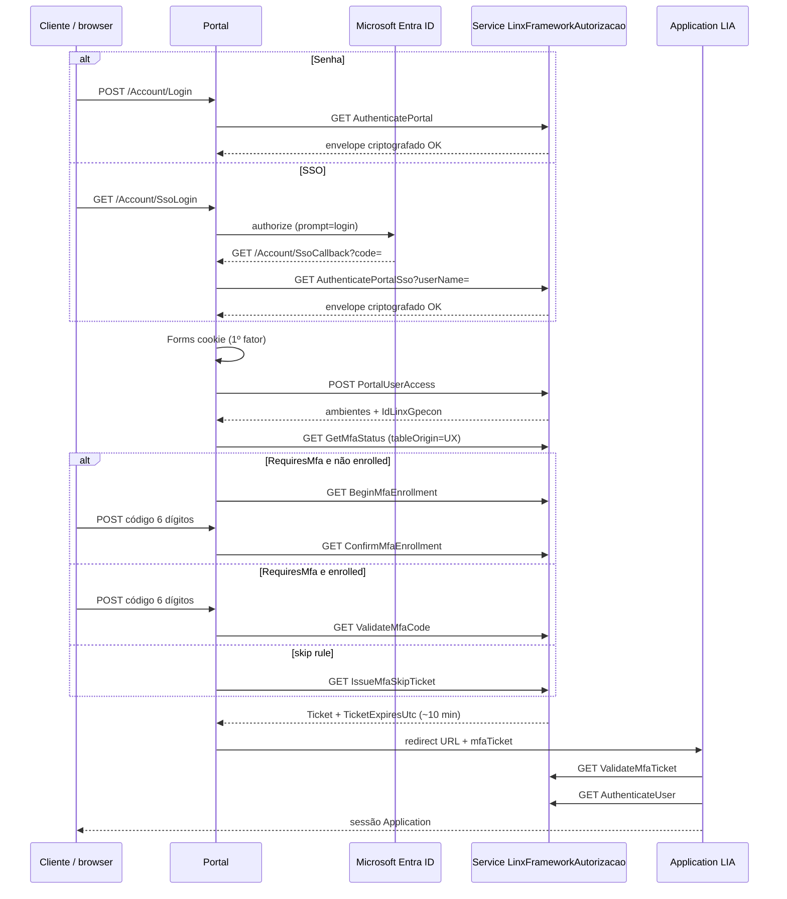

# Login, SSO e MFA — guia técnico das APIs

Documento para integrar o fluxo de autenticação do Linx UX (Portal + Service + Application). **Não existe um único endpoint** “login + SSO + MFA”. O consumidor orquestra as APIs abaixo na ordem descrita.

Base do Service (IIS): `{ServiceUrl}` — em QA AWS, `http://<host>:1710/`.  
Controller: `LinxFrameworkAutorizacao`.  
Criptografia de parâmetros de login e de ticket MFA: `Linx.Security.Cryptography`. Tickets MFA usam `UseSeed = false`.

SSO do Azure **não** encaminha access token ao Service. O Portal prova identidade no Entra ID e só envia o login local (`NomeAutenticacao`).

---

## 1. Visão do fluxo



Regras de produto:

- MFA **não** roda na tela de senha/SSO. Roda **depois** que o GPECON (`IdLinxGpecon`) é conhecido.
- SSO Azure **não** dispensa TOTP Linx.
- Cookie Forms do Portal **não** autoriza o Application sozinho. Application exige `mfaTicket` válido (ou skip documentado).

---

## 2. Origem (`tableOrigin`)

Obrigatório em todas as APIs MFA, exceto `ValidateMfaTicket`.

| Valor na API | Significado | `idUserMfa` |
|--------------|-------------|-------------|
| `UX` | Portal / Application | `TCS_USUARIO_AUTENTICACAO.ID_USUARIO` |
| `PDV` | PDV (schema pronto; **não** ligar neste delivery) | `LJV_VENDEDOR.ID_VENDEDOR` |
| `CLIENTE_CONNECT` | Cliente Connect | id informado pelo caller |

Aliases aceitos só no Service: `TCS_USUARIO_AUTENTICACAO` → `UX`, `LJV_VENDEDOR` → `PDV`.

Entrega atual: use **`UX`**.

`idGpecon` = `TCS_EMPRESA_AUTENTICACAO.ID_LINX` (mesmo valor de `IdLinxGpecon` no Portal). Cadastro MFA é por `(TABLE_ORIGIN, ID_GPCON, ID_USER_MFA)`.

---

## 3. Portal (orquestração HTTP)

Estes endpoints são **MVC do Portal**, não JSON de negócio. Úteis para browser ou para um cliente que imite o Portal.

| Método | Caminho | Papel |
|--------|---------|--------|
| POST | `/Account/Login` | Senha. Campo `ShowEnvironments` (`true` = listar ambientes). |
| GET | `/Account/SsoLogin` | Inicia OAuth Azure (`Prompt.ForceLogin`). 302 para `login.microsoftonline.com`. |
| GET | `/Account/SsoCallback` | Troca `code` → UPN → `AuthenticatePortalSso` → cookie Forms. Sempre `showEnvironments=false`. |
| GET | `/Account/Authenticate` | Login por query/headers `usuario` + `senha`. Default `listaAmbientes=true`. **Sem SSO e sem MFA nesta chamada.** |
| GET | `/Home/Index` | Lista ambientes (`PortalUserAccess`). Auto-redirect se 1 ambiente ou `IndicaAcessoPadrao`. |
| GET | `/Home/Redirect` | Porta de MFA: `GetMfaStatus` → Challenge ou skip ticket → Application. |
| GET/POST | `/Mfa/Challenge`, `/Mfa/Verify` | UI TOTP (QR + 6 dígitos). |
| GET | Application `LIA/Authentication` | Consome querystring do Portal, incluindo `mfaTicket`. |

Redirect URI Azure (Web): `{PortalUrl}/Account/SsoCallback`  
Exemplo QA: `http://localhost:8172/Account/SsoCallback`.

Mapeamento SSO: `UPN` antes de `@` deve ser igual a `NomeAutenticacao` local (case-insensitive no Service).

---

## 4. Service — primeiro fator

Todos GET, querystring, salvo `PortalUserAccess` (POST JSON).

### 4.1 `GET LinxFrameworkAutorizacao/AuthenticatePortal`

Login senha.

| Query | Tipo | Descrição |
|-------|------|-----------|
| `authenticateParameters` | string | `Encrypt( Encrypt(user) + "\|\|" + Encrypt(password) )` |

Headers usados pelo Portal: `X-Client-IP`, `X-Auth-Channel=Portal`.

Resposta (texto, URL-encoded, depois decrypt):

- Sucesso: `1 || NomeUsuario || NomeCurtoUsuario`
- Falha: `0 || mensagem`

Não emite ticket MFA. Não abre Application.

### 4.2 `GET LinxFrameworkAutorizacao/AuthenticatePortalSso`

Login sem senha **depois** do Azure.

| Query | Tipo | Descrição |
|-------|------|-----------|
| `userName` | string | Prefixo do UPN / `NomeAutenticacao` |

Não recebe token Azure. Valida cadastro local + vigência/inativo. Auditoria canal `PortalSSO`.

Resposta decrypt:

- Sucesso: `1 || NomeUsuario || NomeCurtoUsuario || NomeAutenticacao` (canônico)
- Falha: `0 || mensagem` (ex.: sem cadastro local)

Não emite ticket MFA.

### 4.3 `POST LinxFrameworkUsuarioAutorizacao/PortalUserAccess`

Lista ambientes do usuário autenticado.

Body JSON:

```json
{
  "NomeAutenticacao": "usuario.local",
  "AcessoLocal": false,
  "Parametros": ""
}
```

`Parametros` vazio = acesso normal. Preenchido (criptografado) = modo suporte.

Cada item inclui, entre outros: `UidUsuario`, `UidEmpresa`, `UidAplicacao`, `IdTcsAmbiente`, `IdLinxGpecon`, `IndicaAcessoPadrao`, `Url` (Application).

`IdLinxGpecon` é o **GPECON da ficha do usuário** (`TCS_USUARIO_AUTENTICACAO.ID_LINX_GPECON`), não necessariamente a empresa do ambiente.

### 4.4 `GET LinxFrameworkAutorizacao/AuthenticateUser`

Abre sessão de Application (tokens de acesso). Chamar **somente após** MFA/ticket.

| Query | Tipo |
|-------|------|
| `authenticatedUser` | string (`NomeAutenticacao`) |
| `applicationId` | Guid |
| `companyId` | Guid |
| `accessGroupId` | Guid |
| `environmentId` | int (`IdTcsAmbiente`) |

Retorno JSON `LoginInfo`.

---

## 5. Service — MFA TOTP

Todos GET. JSON. `tableOrigin=UX` neste delivery.

Quando informar `uidUsuario`, o Service resolve `ID_USUARIO` e, se `idGpecon` vier 0, usa `ID_LINX_GPECON` do cadastro.

### 5.1 `GET .../GetMfaStatus`

| Query | Tipo |
|-------|------|
| `tableOrigin` | string (`UX`) |
| `idGpecon` | int |
| `idUserMfa` | long (opcional se `uidUsuario` informado) |
| `uidUsuario` | Guid (opcional se `idUserMfa` informado) |

JSON (`MfaStatusResult`):

| Campo | Significado |
|-------|-------------|
| `RequiresMfa` | `true` = exigir TOTP |
| `Enrolled` | já tem secret ativo |
| `MfaLocked` | lockout TOTP (5 falhas → 15 min) |
| `SkipReason` | `INDICA_USUARIO_SERVICO`, `AUTENTICACAO_WINDOWS`, `COMPANY_MFA_OFF`, `USER_MFA_OFF` |
| `CompanyMfaEnabled` | política GPECON (`TCS_GPECON_MFA`; **sem linha = MFA ligado**) |
| `UserUtilizaMfa` | `NULL` no cadastro = **ligado** |
| `UserUtilizaSso` | flag cadastral; **não** controla o login SSO |

### 5.2 `GET .../BeginMfaEnrollment`

Mesmos identificadores de status. Gera secret, `otpauth://totp/` (issuer = nome da empresa + `NomeAutenticacao`) e PNG Base64.

JSON extra: `Success`, `Message`, `OtpauthUri`, `AccountLabel`, `QrCodePngBase64`.

### 5.3 `GET .../ConfirmMfaEnrollment`

| Query | Tipo |
|-------|------|
| `code` | string, 6 dígitos |

Confirma o QR. Se OK: `ATIVO=1` e emite **ticket**.

### 5.4 `GET .../ValidateMfaCode`

| Query | Tipo |
|-------|------|
| `code` | 6 dígitos |
| `canal` | string (Portal usa `Portal`) |

TOTP RFC 6238, passo 30s, janela ±1. Sucesso → ticket.

### 5.5 `GET .../IssueMfaSkipTicket`

Só para regras de skip. Query `reason` (ex. `COMPANY_MFA_OFF`). Emite ticket de 10 minutos.

### 5.6 `GET .../ValidateMfaTicket`

| Query | Tipo |
|-------|------|
| `ticket` | string criptografada |

JSON: `Success`, `Message`, `Ticket`, `TicketExpiresUtc`.

Envelope interno (não logar o plaintext): `MFA||origin||idGpecon||idUserMfa||expUnix||reason`. TTL **10 minutos**.

### 5.7 Administração / flags

| API | Uso |
|-----|-----|
| `GetMfaCompanyPolicy` / `SetMfaCompanyPolicy` | MFA da empresa (`idGpecon`, `indicaMfaHabilitado`, remember-device) |
| `SetUserMfaFlags` | `uidUsuario`, `utilizaSso`, `utilizaMfa` |
| `RevokeMfaSecret` | apaga secret; próximo acesso é enroll de novo |
| `LinkMfaDevice` / `CheckMfaDevice` | API pronta; **UI oculta** neste delivery |

JSON de validação (`MfaValidateResult`): `Success`, `Message`, `Ticket`, `TicketExpiresUtc`, `MfaLocked`.

---

## 6. Application — consumo do ticket

`LIAController.Authentication` lê `mfaTicket` na querystring **ou** header `MfaTicket`.

1. `ValidateMfaTicket`  
2. Se ausente: `GetMfaStatus`; só segue sem ticket se `RequiresMfa=false`  
3. Senão rejeita e manda de volta ao Portal `Home/Redirect?forceMfa=true`  
4. Com ticket OK: `AuthenticateUser` e grava `Session["loginInfo"]`

Query típica montada pelo Portal (`PortalMfaClient.BuildApplicationUrl`):

`uidEmpresa`, `uidUsuario`, `uidAplicacao`, `loginUrl`, `formulario`, `idAmbiente`, `uidGrupoEconomico`, `nomeEmpresa`, `grupoEconomico`, `idGpecon`, `usuarioAutenticacao`, `supportMode`, `urlWorkArea`, **`mfaTicket`**.

---

## 7. Quando o MFA é pulado (`UX`)

| Condição | `SkipReason` |
|----------|----------------|
| `INDICA_USUARIO_SERVICO` | `INDICA_USUARIO_SERVICO` |
| `AUTENTICACAO_WINDOWS` | `AUTENTICACAO_WINDOWS` |
| Linha em `TCS_GPECON_MFA` com `INDICA_MFA_HABILITADO=0` | `COMPANY_MFA_OFF` |
| `INDICA_UTILIZA_MFA = false` | `USER_MFA_OFF` |

Não pular por SSO / MFA Azure.

Suporte/impersonação: desafiar o MFA do **usuário impersonado** no GPECON selecionado.

---

## 8. Receita mínima para um cliente de API (UX)

1. **Identidade**  
   - Browser SSO: `/Account/SsoLogin` → callback, **ou**  
   - `AuthenticatePortal` com envelope criptografado (mesma lib do Portal).
2. **GPECON / ambiente** — `PortalUserAccess`. Usar `IdLinxGpecon` + UIDs da linha escolhida (ou `IndicaAcessoPadrao` / única linha).
3. **MFA** — `GetMfaStatus`.  
   - `RequiresMfa && !Enrolled` → `BeginMfaEnrollment` → usuário confirma → `ConfirmMfaEnrollment`.  
   - `RequiresMfa && Enrolled` → `ValidateMfaCode`.  
   - `!RequiresMfa` → `IssueMfaSkipTicket`.
4. Guardar `Ticket` (≤ 10 min). Não logar secret, `otpauth` completo em produção, nem plaintext do ticket.
5. Chamar Application `Authentication` com os UIDs **e** `mfaTicket`, **ou** `AuthenticateUser` só depois de validar o ticket no Service.

Não chamar `AuthenticatePortalSso` com um login inventado: o contrato assume que o Azure já autenticou no Portal.

---

## 9. Exemplos HTTP (Service)

Status:

```
GET {ServiceUrl}/LinxFrameworkAutorizacao/GetMfaStatus?tableOrigin=UX&idGpecon=123&uidUsuario={guid}
```

Validar código:

```
GET {ServiceUrl}/LinxFrameworkAutorizacao/ValidateMfaCode?tableOrigin=UX&idGpecon=123&uidUsuario={guid}&code=123456&canal=Portal
```

Validar ticket:

```
GET {ServiceUrl}/LinxFrameworkAutorizacao/ValidateMfaTicket?ticket={ticketUrlEncoded}
```

SSO no Service (após Azure no Portal):

```
GET {ServiceUrl}/LinxFrameworkAutorizacao/AuthenticatePortalSso?userName=joao.silva
```

---

## 10. Fora de escopo neste delivery

- MFA no POS (`loginPOS` / `PDV`)
- UI de “lembrar dispositivo” (`LinkMfaDevice` / `CheckMfaDevice`)
- Um token OAuth único Linx que substitua cookie + ticket
- Encaminhar access token Azure ao Service

Código de referência: `LinxFrameworkAutorizacao.cs`, `Autorizacao.Mfa.Operations.cs`, `AccountController.cs`, `HomeController.cs`, `MfaController.cs`, `PortalMfaClient.cs`, `LIAController.cs`.  
Descrição para usuário: [login-mfa-sso-usuario.md](login-mfa-sso-usuario.md).
