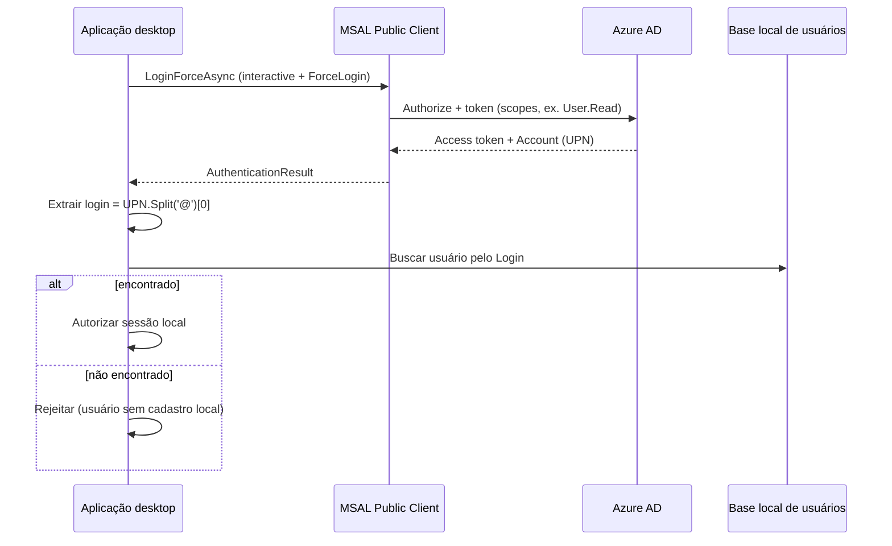

# Guia: SSO com Azure AD (MSAL) — padrão OmniPOS

Este documento descreve o SSO do OmniPOS e o código mínimo para replicar o mesmo padrão em outro aplicativo desktop (.NET / WPF ou similar).

## Visão geral

| Item | Valor |
|------|--------|
| IdP | Microsoft Entra ID (Azure AD) |
| Protocolo | OAuth 2.0 / OpenID Connect |
| Biblioteca | MSAL.NET (`Microsoft.Identity.Client`) |
| Tipo de app | Cliente público (desktop) |
| Uso do token | Provar identidade e obter UPN; **não** encaminhar o token ao backend do POS |
| Mapeamento | `UPN` (antes do `@`) → login local do usuário/operador |



---

## 1. Pré-requisitos no Azure AD

1. Criar um **App Registration** (tipo: Public client / native).
2. Anotar **Application (client) ID** e **Directory (tenant) ID**.
3. Em **Authentication**, cadastrar o **Redirect URI** (ex.: `https://localhost` ou `http://localhost`).
4. Em **API permissions**, conceder o escopo usado (padrão: Microsoft Graph `User.Read`).
5. Se a organização exigir, fazer **admin consent**.

---

## 2. Pacotes NuGet

```xml
<PackageReference Include="Microsoft.Identity.Client" Version="4.83.0" />
<PackageReference Include="Microsoft.Identity.Client.Extensions.Msal" Version="4.83.0" />
```

(Versões alinhadas ao Runtime do OmniPOS; ajuste conforme o target framework do novo app.)

---

## 3. Configuração

Parâmetros usados no OmniPOS (equivalente a `appsettings` / config no outro app):

| Chave | Obrigatório | Padrão | Descrição |
|-------|-------------|--------|-----------|
| `SSO_HABILITA_AUTENTICACAO` | — | `false` | Liga o SSO |
| `SSO_CLIENT_ID` | sim (se SSO on) | — | Client ID do App Registration |
| `SSO_TENANT_ID` | sim (se SSO on) | — | Tenant ID |
| `SSO_REDIRECT_URI` | não | `https://localhost` | Deve bater com o Azure |
| `SSO_SCOPES` | não | `User.Read` | Escopos MSAL |
| `SSO_PERMITE_OFFLINE` | não | `false` | Permite fallback para login/senha local |
| `SSO_TIMEOUT_RESPOSTA` | não | `120` | Lido no OmniPOS (não aplicado de fato no fluxo atual) |

Exemplo em config genérica:

```json
{
  "AzureAd": {
    "ClientId": "<APPLICATION_CLIENT_ID>",
    "TenantId": "<DIRECTORY_TENANT_ID>",
    "RedirectUri": "https://localhost",
    "Scopes": [ "User.Read" ]
  },
  "Sso": {
    "Enabled": true,
    "AllowOfflineFallback": true
  }
}
```

---

## 4. Código portável (camada de autenticação)

Copie/adapte estas classes. No OmniPOS elas ficam em `Linx.OmniPOS.Authentication`.

### 4.1 Options

```csharp
public class AzureAdOptions
{
    public string ClientId { get; set; }
    public string TenantId { get; set; }
    public string RedirectUri { get; set; }
    public string[] Scopes { get; set; }
    public string Authority => $"https://login.microsoftonline.com/{TenantId}";
}
```

### 4.2 Models

```csharp
public class AuthenticatedUser
{
    public string Username { get; set; }   // UPN, ex.: joao.silva@empresa.com
    public string Name { get; set; }
    public string TenantId { get; set; }
    public string ObjectId { get; set; }
}

public class AuthenticationResultModel
{
    public string AccessToken { get; set; }
    public DateTimeOffset ExpiresOn { get; set; }
    public AuthenticatedUser User { get; set; }
    public bool IsAuthenticated { get; set; }
    public string Message { get; set; }
}
```

### 4.3 Abstrações

```csharp
public interface IAuthenticationService
{
    Task<AuthenticationResultModel> LoginAsync();
    Task<AuthenticationResultModel> LoginSilentAsync();
    Task<AuthenticationResultModel> LoginForceAsync();
    Task LogoutAsync();
    bool IsAuthenticated { get; }
    AuthenticatedUser CurrentUser { get; }
}

public interface ITokenCacheStore
{
    void RegisterCache(ITokenCache tokenCache);
    void Clear();
}
```

### 4.4 Cache persistente (MSAL)

```csharp
using Microsoft.Identity.Client;
using Microsoft.Identity.Client.Extensions.Msal;

public class DpapiTokenCacheStore : ITokenCacheStore
{
    private readonly string _cacheFilePath;

    public DpapiTokenCacheStore(string cacheName, string appFolderName = "MyApp")
    {
        var dir = Path.Combine(
            Environment.GetFolderPath(Environment.SpecialFolder.LocalApplicationData),
            appFolderName,
            "AuthCache");

        Directory.CreateDirectory(dir);
        _cacheFilePath = Path.Combine(dir, cacheName);
    }

    public void RegisterCache(ITokenCache tokenCache)
    {
        var storageProperties = new StorageCreationPropertiesBuilder(
            Path.GetFileName(_cacheFilePath),
            Path.GetDirectoryName(_cacheFilePath))
            .Build();

        var helper = MsalCacheHelper.CreateAsync(storageProperties)
            .GetAwaiter()
            .GetResult();

        helper.RegisterCache(tokenCache);
    }

    public void Clear()
    {
        if (File.Exists(_cacheFilePath))
            File.Delete(_cacheFilePath);
    }
}
```

### 4.5 Serviço MSAL (núcleo do SSO)

```csharp
using Microsoft.Identity.Client;

public class MsalAuthenticationService : IAuthenticationService
{
    private readonly AzureAdOptions _options;
    private readonly IPublicClientApplication _app;
    private readonly ITokenCacheStore _cache;

    public bool IsAuthenticated => CurrentUser != null;
    public AuthenticatedUser CurrentUser { get; private set; }

    public MsalAuthenticationService(AzureAdOptions options, ITokenCacheStore cacheStore)
    {
        _options = options;
        _cache = cacheStore;

        _app = PublicClientApplicationBuilder
            .Create(_options.ClientId)
            .WithAuthority(_options.Authority)
            .WithRedirectUri(_options.RedirectUri)
            .Build();

        _cache.RegisterCache(_app.UserTokenCache);
    }

    public async Task<AuthenticationResultModel> LoginAsync()
    {
        var result = await _app
            .AcquireTokenInteractive(_options.Scopes)
            .ExecuteAsync();

        return MapResult(result);
    }

    public async Task<AuthenticationResultModel> LoginSilentAsync()
    {
        var account = (await _app.GetAccountsAsync()).FirstOrDefault();
        if (account == null)
            return null;

        var result = await _app
            .AcquireTokenSilent(_options.Scopes, account)
            .ExecuteAsync();

        return MapResult(result);
    }

    /// <summary>
    /// Fluxo usado pelo OmniPOS: sempre força tela de login do Azure.
    /// </summary>
    public async Task<AuthenticationResultModel> LoginForceAsync()
    {
        var result = await _app
            .AcquireTokenInteractive(_options.Scopes)
            .WithPrompt(Prompt.ForceLogin)
            .ExecuteAsync();

        return MapResult(result);
    }

    public async Task LogoutAsync()
    {
        foreach (var account in await _app.GetAccountsAsync())
            await _app.RemoveAsync(account);

        _cache.Clear();
        CurrentUser = null;
    }

    private AuthenticationResultModel MapResult(AuthenticationResult result)
    {
        CurrentUser = new AuthenticatedUser
        {
            Username = result.Account.Username,
            Name = result.ClaimsPrincipal?.Identity?.Name,
            TenantId = result.TenantId,
            ObjectId = result.UniqueId
        };

        return new AuthenticationResultModel
        {
            AccessToken = result.AccessToken,
            ExpiresOn = result.ExpiresOn,
            User = CurrentUser,
            IsAuthenticated = true
        };
    }
}
```

---

## 5. Orquestração na aplicação (padrão OmniPOS)

Depois do MSAL, o app **mapeia o UPN para um usuário local** e só então libera a sessão.

### 5.1 Extrair login do UPN

```csharp
// Azure: joao.silva@empresa.com  →  local: joao.silva
private static string ExtractLocalLogin(string upn)
{
    if (string.IsNullOrWhiteSpace(upn))
        return null;

    var at = upn.IndexOf('@');
    var local = (at > 0 ? upn.Substring(0, at) : upn).ToLowerInvariant();
    return local;
}
```

### 5.2 Login SSO + mapear usuário local

```csharp
public async Task<(bool ok, int? localUserId, string message)> AuthenticateWithSsoAsync(
    Func<string, Task<(bool found, int userId)>> findLocalUserByLogin)
{
    var authService = new MsalAuthenticationService(
        new AzureAdOptions
        {
            ClientId = config.ClientId,
            TenantId = config.TenantId,
            RedirectUri = config.RedirectUri ?? "https://localhost",
            Scopes = config.Scopes ?? new[] { "User.Read" }
        },
        new DpapiTokenCacheStore("msal.cache", "MyApp"));

    try
    {
        var result = await authService.LoginForceAsync();
        if (!authService.IsAuthenticated || result?.User == null)
            return (false, null, "Usuário não autenticado.");

        var localLogin = ExtractLocalLogin(result.User.Username);
        var (found, userId) = await findLocalUserByLogin(localLogin);

        if (!found)
            return (false, null,
                "Usuário autenticado no Azure, mas sem cadastro local. Ajuste o login na retaguarda.");

        // Sessão da aplicação = usuário local (não o token Azure)
        CurrentUserId = userId;
        return (true, userId, null);
    }
    catch (MsalClientException ex) when (ex.ErrorCode == "authentication_canceled")
    {
        return (false, null, "O usuário abortou o processo de autenticação.");
    }
    catch (MsalClientException ex) when (ex.ErrorCode == "authentication_ui_failed")
    {
        // Candidato a modo contingência / fallback offline
        return (false, null, "Não foi possível estabelecer conexão com o servidor.");
    }
    catch (Exception)
    {
        return (false, null, "Não foi possível realizar autenticação.");
    }
}
```

### 5.3 Pontos de chamada (como no OmniPOS)

1. **Boot do app** — se SSO estiver ligado, autenticar antes de liberar a UI principal.
2. **Operações sensíveis** — sempre que a app pedir “operador/gerente”, chamar SSO de novo (`LoginForceAsync`).
3. **Fallback offline** (opcional) — se `AllowOfflineFallback` e falha de UI/rede, usar o login/senha clássico local e marcar um flag em memória (`EnableContingencySSO` no OmniPOS).

Pseudofluxo:

```text
if (SSO habilitado && não está em contingência)
    → LoginForceAsync (Azure)
    → mapear UPN → usuário local
    → setar CurrentOperatorId / sessão
else
    → diálogo clássico usuário/senha local
```

### 5.4 Tratamento de erros MSAL (como no OmniPOS)

| `ErrorCode` | Mensagem sugerida | Sugerir contingência? |
|-------------|-------------------|------------------------|
| `authentication_canceled` | Usuário abortou | não |
| `authentication_ui_failed` | Sem conexão com o servidor | sim |
| outros | Erro inesperado | não |

---

## 6. Regras de negócio importantes

1. **Token Azure não autentica API do POS** — só identifica o usuário; a autorização operacional é do cadastro local.
2. **Login local deve coincidir com a parte do UPN antes do `@`** (case-insensitive no OmniPOS).
3. **SSO e governança local exclusivos** — no OmniPOS, `SSO_HABILITA_AUTENTICACAO` e `HABILITA_GOVERNANCA_ACESSO` não podem estar ligados ao mesmo tempo.
4. **ForceLogin sempre** — o OmniPOS não usa silent login no fluxo principal (cache existe, mas a UX força prompt).
5. **Contingência é só em memória** — reiniciar o processo limpa o modo offline.

---

## 7. Checklist para outro aplicativo

- [ ] App Registration no Azure AD (public client + redirect URI + scopes)
- [ ] Pacotes `Microsoft.Identity.Client` (+ Extensions.Msal se for cache em disco)
- [ ] Classes: `AzureAdOptions`, models, `IAuthenticationService`, `MsalAuthenticationService`, cache
- [ ] Config: ClientId, TenantId, RedirectUri, Scopes, Enabled, AllowOfflineFallback
- [ ] No login: `LoginForceAsync` → extrair UPN → buscar usuário local → abrir sessão local
- [ ] Cadastro local com `Login` igual ao prefixo do e-mail corporativo
- [ ] (Opcional) Fallback senha local quando UI/rede falhar
- [ ] Validar que Redirect URI e Tenant batem com o ambiente real

---

## 8. Referência no repositório OmniPOS

| Arquivo | Papel |
|---------|--------|
| `Linx OmniPOS - Main/Main/App/Windows/App/Linx.OmniPOS.Authentication/Services/MsalAuthenticationService.cs` | Wrapper MSAL |
| `.../Configuration/AzureAdOptions.cs` | ClientId / Tenant / Authority |
| `.../TokenCache/DpapiTokenCacheStore.cs` | Cache em `%LocalAppData%\LinxOmniPOS\AuthCache\` |
| `.../Models/AuthenticatedUser.cs`, `AuthenticationResultModel.cs` | DTOs |
| `.../Base.ViewModel/ViewModelBase.cs` | `RequestOperatorSSO`, `LoadAuthenticationSSO`, `ExecuteAuthenticationSSO`, `ObtemOperadorLoja` |
| `.../Base.ViewModel/MainWindowViewModel.cs` | Validação de parâmetros + SSO no boot |
| `.../ClientTools/EnvironmentBase.cs` | `EnableContingencySSO` |

---

## 9. Exemplo mínimo de uso (console / teste)

```csharp
var options = new AzureAdOptions
{
    ClientId = Environment.GetEnvironmentVariable("SSO_CLIENT_ID"),
    TenantId = Environment.GetEnvironmentVariable("SSO_TENANT_ID"),
    RedirectUri = "https://localhost",
    Scopes = new[] { "User.Read" }
};

var service = new MsalAuthenticationService(options, new DpapiTokenCacheStore("msal.cache", "SsoSample"));
var result = await service.LoginForceAsync();

Console.WriteLine($"UPN: {result.User.Username}");
Console.WriteLine($"Login local esperado: {result.User.Username.Split('@')[0].ToLowerInvariant()}");
Console.WriteLine($"Token expira: {result.ExpiresOn}");
```

Com isso, a outra aplicação replica o mesmo SSO do OmniPOS: **MSAL público contra Azure AD + mapeamento UPN → usuário local + sessão local**.

---

## 10. Adaptação Linx Portal (este repositório)

O guia OmniPOS é desktop (public client + `LoginForceAsync`). No **Linx Portal** (ASP.NET MVC / IIS) o mesmo padrão de negócio foi aplicado assim:

| OmniPOS | Portal |
|---------|--------|
| `LoginForceAsync` (UI MSAL) | `Account/SsoLogin` → authorize URL com `Prompt.ForceLogin` |
| Token interativo | `Account/SsoCallback` + `AcquireTokenByAuthorizationCode` |
| Public client | **Confidential client** (`SSO_CLIENT_SECRET`) — App Registration tipo Web |
| Sessão local | `FormsAuthentication.SetAuthCookie(NomeAutenticacao)` |
| Busca usuário local | `LinxFrameworkAutorizacao/AuthenticatePortalSso` (sem senha) |
| Contingência | Session `EnableContingencySSO` + `SSO_PERMITE_OFFLINE` |

Configuração em `PortalSettings` (`Main/Application/Linx.Portal/.../Web.config` e Binary):

- `SSO_HABILITA_AUTENTICACAO`
- `SSO_CLIENT_ID` / `SSO_TENANT_ID` / `SSO_CLIENT_SECRET`
- `SSO_REDIRECT_URI` (ex.: `http://host:8172/Account/SsoCallback`)
- `SSO_SCOPES` (padrão `User.Read`)
- `SSO_PERMITE_OFFLINE`
- `SSO_TIMEOUT_RESPOSTA`

Código: `Main/Application/Linx.Portal/Linx.Portal/Authentication/*` e `AccountController` (`SsoLogin` / `SsoCallback`).

**Importante:** o login local (`NomeAutenticacao`) deve coincidir com o prefixo do UPN Azure (antes do `@`), case-insensitive.
